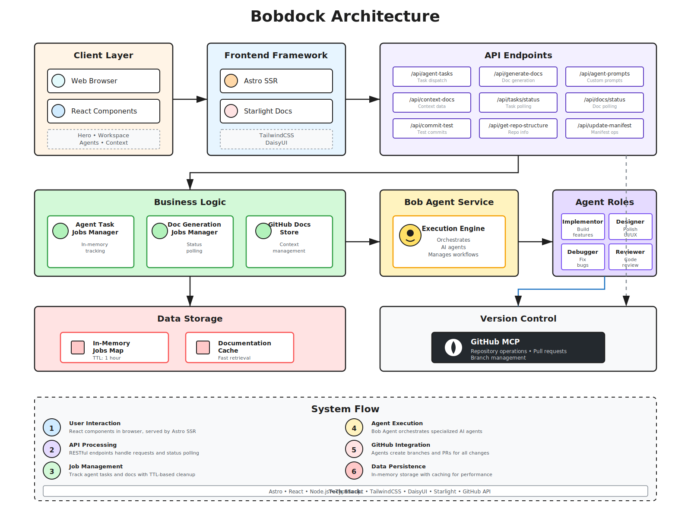

# Bobdock

**Cloud-Native Agentic Development Platform**

Bobdock transforms software development into a spec-driven experience. Connect your repository, generate intelligent documentation, and dispatch specialized AI agents—all without touching a terminal or IDE.

## 🚀 Overview

Bobdock is a cloud-native platform that enables developers to command, dispatch, and manage Bob agents in the cloud. It provides a seamless interface for AI-powered software development through specialized agents that handle different aspects of the development lifecycle.

### Key Features

- **🤖 Specialized AI Agents**: Four distinct agents for different development tasks
  - **Designer**: Architecture and system design
  - **Implementor**: Code implementation and feature development
  - **Reviewer**: Code review and quality assurance
  - **Debugger**: Issue identification and debugging

- **📚 Intelligent Documentation**: Automatic generation of project documentation from your repository
- **☁️ Cloud-Native**: Run Bob agents in containerized cloud environments
- **🔄 Spec-Driven Development**: Transform specifications into working code
- **🎯 Context-Aware**: Agents understand your project structure and codebase

## 🏗️ Architecture

The platform consists of two main components:

### Frontend (Astro + React)
- Modern web interface built with Astro and React
- Styled with Tailwind CSS and DaisyUI
- Interactive workspace for managing agents and viewing documentation

### Backend (BobCloud)
- Node.js/Express API wrapper for IBM Bob Shell
- Docker containerization for isolated agent execution
- MCP (Model Context Protocol) integration



## 📋 Prerequisites

- Node.js >= 22.12.0
- npm or yarn
- Docker (for BobCloud deployment)

## 🛠️ Installation

### Frontend Setup

```bash
# Install dependencies
npm install

# Start development server
npm run dev

# Build for production
npm run build

# Preview production build
npm run preview
```

### BobCloud Setup

```bash
# Navigate to bobcloud directory
cd bobcloud

# Install dependencies
npm install

# Start the service
npm start
```

### Docker Deployment

```bash
# Build and run BobCloud container
cd bobcloud
docker build -t bobcloud .
docker run -p 3000:3000 bobcloud
```

## 📁 Project Structure

```
bobdock/
├── src/
│   ├── components/          # React components
│   │   ├── AgentsSection.tsx
│   │   ├── BobdockWorkspace.tsx
│   │   ├── ContextPanel.tsx
│   │   └── Hero.tsx
│   ├── pages/              # Astro pages and API routes
│   │   ├── api/            # API endpoints
│   │   │   ├── agent-prompts.ts
│   │   │   ├── agent-tasks.ts
│   │   │   ├── commit-test.ts
│   │   │   ├── generate-docs.ts
│   │   │   └── context-docs.ts
│   │   ├── app.astro       # Main application page
│   │   └── index.astro     # Landing page
│   ├── lib/                # Utility libraries
│   │   ├── agentTaskJobs.ts
│   │   ├── docGenerationJobs.ts
│   │   └── githubDocsStore.ts
│   └── styles/             # Global styles
├── bobcloud/               # Cloud service backend
│   ├── server.js           # Express server
│   ├── BobShellExecutor.js # Bob Shell integration
│   ├── Dockerfile          # Container configuration
│   └── scripts/            # Deployment scripts
└── public/                 # Static assets
    └── *.svg               # Agent and architecture diagrams
```

## 🎯 Usage

### Launching the Platform

1. Start the development server:
   ```bash
   npm run dev
   ```

2. Open your browser to `http://localhost:4321`

3. Click "Launch Platform" to access the main workspace

### Working with Agents

1. **Connect Repository**: Link your GitHub repository to the platform
2. **Generate Documentation**: Let Bobdock analyze and document your codebase
3. **Dispatch Agents**: Select an agent and provide task specifications
4. **Monitor Progress**: Track agent execution in real-time
5. **Review Results**: Examine generated code, reviews, or debugging insights

### API Endpoints

- `POST /api/agent-tasks` - Create and dispatch agent tasks
- `GET /api/agent-tasks/status` - Check task status
- `POST /api/generate-docs` - Generate project documentation
- `GET /api/generate-docs/status` - Check documentation generation status
- `POST /api/commit-test` - Test commit operations
- `GET /api/context-docs` - Retrieve context documentation

## 🔧 Configuration

### Environment Variables

Create a `.env` file in the root directory for the frontend:

```env
BOB_AGENT_BASE_URL=http://localhost:3000
```

Create a `.env` file in the `bobcloud/` directory for the backend:

```env
BOBSHELL_API_KEY=your_api_key
PORT=3000
```

### BobCloud Configuration

Configure MCP settings in `bobcloud/mcp_settings.json` and Bob Shell settings in `bobcloud/settings.json`.

## 🧪 Development

### Available Commands

| Command | Action |
|---------|--------|
| `npm run dev` | Start local dev server at `localhost:4321` |
| `npm run build` | Build production site to `./dist/` |
| `npm run preview` | Preview production build locally |
| `npm run astro ...` | Run Astro CLI commands |

### Tech Stack

- **Frontend**: Astro, React 19, TypeScript
- **Styling**: Tailwind CSS 4, DaisyUI
- **Backend**: Node.js, Express
- **Documentation**: Astro Starlight, Marked
- **Containerization**: Docker

## 🤝 Contributing

Contributions are welcome! Please feel free to submit a Pull Request.

## 📄 License

This project is licensed under the MIT License.

## 🔗 Links

- [Astro Documentation](https://docs.astro.build)
- [React Documentation](https://react.dev)
- [Tailwind CSS](https://tailwindcss.com)

## 💡 Support

For questions and support, please open an issue in the repository.

---

Built with ❤️ using Astro and React
